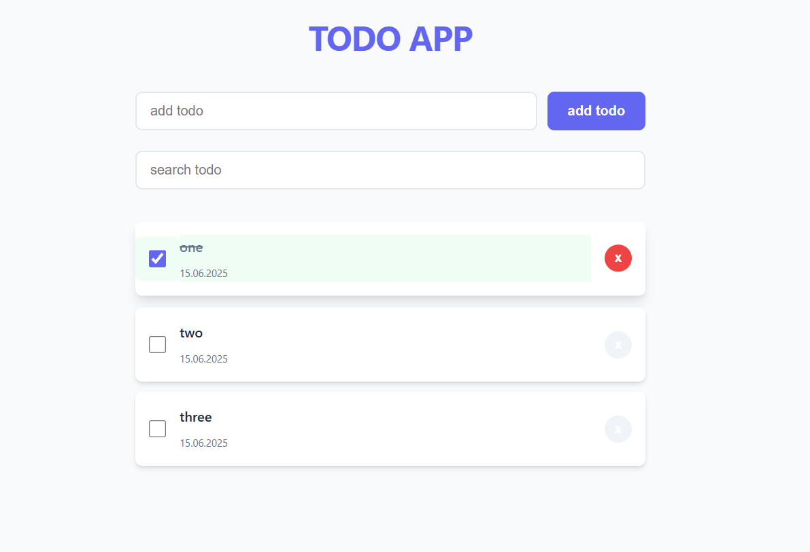

# Todo App: js task manager app

## Preview



## Description
A simple task management app with the ability to add, mark as done, search and delete tasks.
This is a project for
<pre> https://roadmap.sh/projects/task-tracker-js </pre>

## Features

- Adding new tasks
- Marking completed tasks
- Searching the task list
- Deleting completed tasks
- Saving tasks to LocalStorage

## Technologies

- HTML5
- CSS3 
- JavaScript (ES6 Modules, LocalStorage API)
- Responsive Design

## Project structure

```plaintext
todo-app/
├── index.html          # Main page
├── style.css          # Application styles
├── javascript/
│   ├── script.js      # Core logic
│   └── utilits.js     # Utility functions
├── img/
│   └── todo_app_example.png # Screenshot (optional)
└── README.md          # This file
```

## Installation and Usage

1.  Clone the repository:
```bash
git clone https://github.com/meh-pwn/todo-app.git
```
2.  Open "index.html" in your browser.

## License

MIT License. See LICENSE for details.
